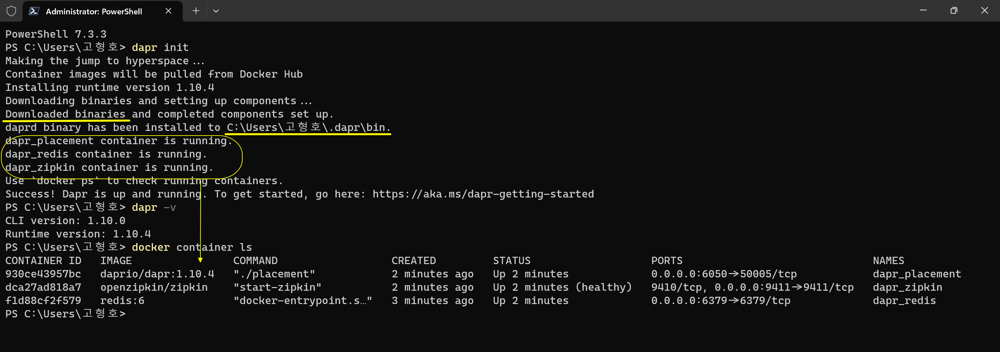
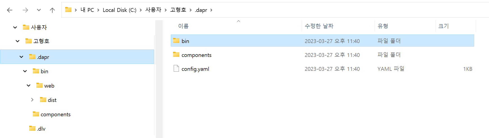

# Dapr 런타임 초기화
> Initialize Dapr in your local environment  
> Dapr CLI을 이용하여 Dapr 런타임을 구성합니다.
> ```shell
> # dapr 런타임 초기화 : dapr_redis, dapr_zipkin, dapr_placement 컨테이너 인스턴스 실행과 %USERPROFILE%/.dapr 폴더 생성
> dapr init
>
> # dapr 컨테이너 이미지 확인
> docker image ls
>
> # dapr 컨테이너 인스턴스 확인
> docker container ls
> ```

## 목차
- [x] Dapr 런타임 초기화 개요
- [x] Dapr 런타임 초기화 명령
- [x] Dapr 컴포넌트 폴더
- [x] 참고 자료

<br/>

## Dapr 런타임 초기화 개요
- Dapr 런타임 초기화 작업을 수행하면 관련 컨테이너를 다운로드 받아 실행하고 컴포넌트 정의 폴더를 생성합니다.
  - `dapr_redis` : 로컬 상태 저장과 메시지 브로커을 위한 Redis 컨테이너 인스턴스를 실행합니다.
  - `dapr_zipkin` : Observability(관찬 가능성)을 위한 Zipkin 컨테이너 인스턴스를 실행합니다.
  - `dapr_placement` : 로컬 액터 모데을 위한 Dapr placement service 컨테이너 인스턴스를 실행합니다.
  - `%USERPROFILE%/.dapr` : 컴포넌트 정의를 위한 기본 폴더를 생성합니다.

<br/>

## Dapr 런타임 초기화


```shell
# Windows Terminal을 관리자 권한으로 실행(Run as administrator)합니다.

#
# dapr 런타임 초기화 : dapr init
#
PS C:\Users\고형호> dapr init
Making the jump to hyperspace...
Container images will be pulled from Docker Hub
Installing runtime version 1.10.4
Downloading binaries and setting up components...
Downloaded binaries and completed components set up.
daprd binary has been installed to C:\Users\고형호\.dapr\bin.
dapr_placement container is running.
dapr_redis container is running.
dapr_zipkin container is running.
Use `docker ps` to check running containers.
Success! Dapr is up and running. To get started, go here: https://aka.ms/dapr-getting-started

#
# dapr 버전 확인 : dapr -v
#   - dapr 런타임 버전 : Runtime version: 1.10.4
#
PS C:\Users\고형호> dapr -v
CLI version: 1.10.0
Runtime version: 1.10.4

#
# dapr 관련 컨테이너 이미지 : docker image ls
#   - `dapr_redis` : 로컬 상태 저장과 메시지 브로커을 위한 Redis 컨테이너 인스턴스를 실행합니다.
#   - `dapr_zipkin` : Observability(관찬 가능성)을 위한 Zipkin 컨테이너 인스턴스를 실행합니다.
#   - `dapr_placement` : 로컬 액터 모데을 위한 Dapr placement service 컨테이너 인스턴스를 실행합니다.
#
PS C:\Users\고형호> docker image ls
REPOSITORY          TAG       IMAGE ID       CREATED        SIZE
redis               6         55ee3f86a3bb   5 days ago     113MB
daprio/dapr         1.10.4    16ab4ab09c63   11 days ago    309MB
openzipkin/zipkin   latest    ad5bf93e3f50   3 months ago   165MB

#
# dapr 관련 컨테이너 : docker container ls
#
PS C:\Users\고형호> docker container ls
CONTAINER ID   IMAGE                COMMAND                  CREATED              STATUS                        PORTS                              NAMES
b81deb7baa38   daprio/dapr:1.10.4   "./placement"            About a minute ago   Up About a minute             0.0.0.0:6050->50005/tcp            dapr_placement
3fc3e21cacf4   openzipkin/zipkin    "start-zipkin"           About a minute ago   Up About a minute (healthy)   9410/tcp, 0.0.0.0:9411->9411/tcp   dapr_zipkin
52dbe90a79a0   redis:6              "docker-entrypoint.s…"   About a minute ago   Up About a minute             0.0.0.0:6379->6379/tcp             dapr_redis
```

<br/>

## Dapr 컴포넌트 폴더
```shell
# 컴포넌트 폴더 열기
explorer "%USERPROFILE%\.dapr\"

# %USERPROFILE%\.dapr\ 폴더 구조 확인하기
.dapr
│   config.yaml
│
├───bin
│   │   daprd.exe
│   │   dashboard.exe
│   │
│   └───web
│       ... 
│
└───components
        pubsub.yaml
        statestore.yaml
```



<br/>

## 참고 자료
- [ ] [Initialize Dapr in your local environment](https://docs.dapr.io/getting-started/install-dapr-selfhost/)
