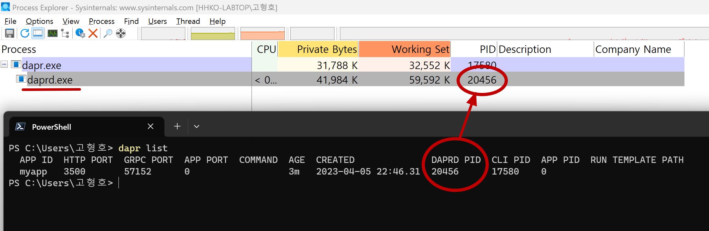

# Dapr Hello Sidecar 예제

## Dapr Sidecar 실행
```shell
dapr run --app-id myapp --dapr-http-port 3500
```


## Dapr Sidecar 데이터 생성(Create)
```shell
#
# Dapr Sidecar HTTP API
#   - http://localhost:{--dapr-http-port}/v1.0/state/statestore
#
Invoke-RestMethod `
    -Method Post `
    -ContentType 'application/json' `
    -Uri 'http://localhost:3500/v1.0/state/statestore' `
    -Body '[{ "key": "name", "value": "Hello Sidecar"}]'
```


```shell
# C o
# http://localhost:{--dapr-http-port}/v1.0/state/statestore
# R o
# U x
# D o
# http://localhost:{--dapr-http-port}/v1.0/state/statestore/{키}


#
# JSON
#
# [
#   {
#     "key": "name",
#     "value": "Bruce Wayne"
#   }
# ]

# docker container exec -it dapr_redis redis-cli
# 127.0.0.1:6379> keys *
# (empty array)

#
# Dapr API 데이터 추가 : 키와 값 추가
#
Invoke-RestMethod `
    -Method Post `
    -ContentType 'application/json' `
    -Uri 'http://localhost:3500/v1.0/state/statestore' `
    -Body '[{ "key": "name", "value": "Bruce Wayne"}]'

#
# Dapr API 데이터 확인 : 값 확인
#
Invoke-RestMethod `
    -Uri 'http://localhost:3500/v1.0/state/statestore/name'
Bruce Wayne

# 컨테이너 인스턴스 접속
docker container exec -it dapr_redis redis-cli

# 컨테이너 인스턴스 키 확인
127.0.0.1:6379> keys *
1) "myapp||name"

| --app-id  | myapp     |
| key       | name      |

# 컨테이너 인스턴스 값 확인
127.0.0.1:6379> hgetall "myapp||name"
1) "data"
2) "\"Bruce Wayne\""
3) "version"
4) "1"

#
# Dapr API 데이터 삭제 : 키
#
Invoke-RestMethod `
    -Method Delete `
    -ContentType 'application/json' `
    -Uri 'http://localhost:3500/v1.0/state/statestore/name'
```


```shell
PS C:\> dapr run --app-id myapp --dapr-http-port 3500
WARNING: no application command found.
Starting Dapr with id myapp. HTTP Port: 3500. gRPC Port: 56024
Checking if Dapr sidecar is listening on HTTP port 3500
time="2023-03-29T21:30:08.3864194+09:00" level=info msg="starting Dapr Runtime -- version 1.10.4 -- commit 42964736b1e99c9c03595c80c61fbe77912391c8" app_id=myapp instance=HHKO-LABTOP scope=dapr.runtime type=log ver=1.10.4
time="2023-03-29T21:30:08.3869261+09:00" level=info msg="log level set to: info" app_id=myapp instance=HHKO-LABTOP scope=dapr.runtime type=log ver=1.10.4
time="2023-03-29T21:30:08.3874603+09:00" level=info msg="metrics server started on :56025/" app_id=myapp instance=HHKO-LABTOP scope=dapr.metrics type=log ver=1.10.4
time="2023-03-29T21:30:08.3935234+09:00" level=info msg="Resiliency configuration loaded." app_id=myapp instance=HHKO-LABTOP scope=dapr.runtime type=log ver=1.10.4
time="2023-03-29T21:30:08.3950962+09:00" level=info msg="standalone mode configured" app_id=myapp instance=HHKO-LABTOP scope=dapr.runtime type=log ver=1.10.4
time="2023-03-29T21:30:08.3950962+09:00" level=info msg="app id: myapp" app_id=myapp instance=HHKO-LABTOP scope=dapr.runtime type=log ver=1.10.4
time="2023-03-29T21:30:08.3956177+09:00" level=info msg="mTLS is disabled. Skipping certificate request and tls validation" app_id=myapp instance=HHKO-LABTOP scope=dapr.runtime type=log ver=1.10.4
time="2023-03-29T21:30:08.3961375+09:00" level=info msg="Dapr trace sampler initialized: DaprTraceSampler(P=1.000000)" app_id=myapp instance=HHKO-LABTOP scope=dapr.runtime type=log ver=1.10.4
time="2023-03-29T21:30:08.4681852+09:00" level=info msg="local service entry announced: myapp -> 192.168.45.127:56026" app_id=myapp component="mdns (nameResolution/v1)" instance=HHKO-LABTOP scope=dapr.contrib type=log ver=1.10.4
time="2023-03-29T21:30:08.4681852+09:00" level=info msg="Initialized name resolution to mdns" app_id=myapp instance=HHKO-LABTOP scope=dapr.runtime type=log ver=1.10.4
time="2023-03-29T21:30:08.4687619+09:00" level=info msg="loading components" app_id=myapp instance=HHKO-LABTOP scope=dapr.runtime type=log ver=1.10.4
time="2023-03-29T21:30:08.5164489+09:00" level=info msg="component loaded. name: pubsub, type: pubsub.redis/v1" app_id=myapp instance=HHKO-LABTOP scope=dapr.runtime type=log ver=1.10.4
time="2023-03-29T21:30:08.5215751+09:00" level=info msg="waiting for all outstanding components to be processed" app_id=myapp instance=HHKO-LABTOP scope=dapr.runtime type=log ver=1.10.4
time="2023-03-29T21:30:08.5344883+09:00" level=info msg="detected actor state store: statestore" app_id=myapp instance=HHKO-LABTOP scope=dapr.runtime type=log ver=1.10.4
time="2023-03-29T21:30:08.5353298+09:00" level=info msg="component loaded. name: statestore, type: state.redis/v1" app_id=myapp instance=HHKO-LABTOP scope=dapr.runtime type=log ver=1.10.4
time="2023-03-29T21:30:08.5353298+09:00" level=info msg="all outstanding components processed" app_id=myapp instance=HHKO-LABTOP scope=dapr.runtime type=log ver=1.10.4
time="2023-03-29T21:30:08.5358344+09:00" level=info msg="gRPC proxy enabled" app_id=myapp instance=HHKO-LABTOP scope=dapr.runtime type=log ver=1.10.4
time="2023-03-29T21:30:08.5363609+09:00" level=info msg="gRPC server listening on TCP address: :56024" app_id=myapp instance=HHKO-LABTOP scope=dapr.runtime.grpc.api type=log ver=1.10.4
time="2023-03-29T21:30:08.5368872+09:00" level=info msg="Enabled gRPC tracing middleware" app_id=myapp instance=HHKO-LABTOP scope=dapr.runtime.grpc.api type=log ver=1.10.4
time="2023-03-29T21:30:08.5368872+09:00" level=info msg="Enabled gRPC metrics middleware" app_id=myapp instance=HHKO-LABTOP scope=dapr.runtime.grpc.api type=log ver=1.10.4
time="2023-03-29T21:30:08.5374147+09:00" level=info msg="configuring workflow engine gRPC endpoint" app_id=myapp instance=HHKO-LABTOP scope=dapr.runtime.wfengine type=log ver=1.10.4
time="2023-03-29T21:30:08.5374147+09:00" level=info msg="API gRPC server is running on port 56024" app_id=myapp instance=HHKO-LABTOP scope=dapr.runtime type=log ver=1.10.4
time="2023-03-29T21:30:08.5395651+09:00" level=info msg="enabled metrics http middleware" app_id=myapp instance=HHKO-LABTOP scope=dapr.runtime.http type=log ver=1.10.4
time="2023-03-29T21:30:08.5395651+09:00" level=info msg="enabled tracing http middleware" app_id=myapp instance=HHKO-LABTOP scope=dapr.runtime.http type=log ver=1.10.4
time="2023-03-29T21:30:08.5395651+09:00" level=info msg="HTTP server listening on TCP address: :3500" app_id=myapp instance=HHKO-LABTOP scope=dapr.runtime.http type=log ver=1.10.4
time="2023-03-29T21:30:08.5406119+09:00" level=info msg="http server is running on port 3500" app_id=myapp instance=HHKO-LABTOP scope=dapr.runtime type=log ver=1.10.4
time="2023-03-29T21:30:08.5406119+09:00" level=info msg="The request body size parameter is: 4" app_id=myapp instance=HHKO-LABTOP scope=dapr.runtime type=log ver=1.10.4
time="2023-03-29T21:30:08.5406119+09:00" level=info msg="gRPC server listening on TCP address: :56026" app_id=myapp instance=HHKO-LABTOP scope=dapr.runtime.grpc.internal type=log ver=1.10.4
time="2023-03-29T21:30:08.5406119+09:00" level=info msg="Enabled gRPC tracing middleware" app_id=myapp instance=HHKO-LABTOP scope=dapr.runtime.grpc.internal type=log ver=1.10.4
time="2023-03-29T21:30:08.5411442+09:00" level=info msg="Enabled gRPC metrics middleware" app_id=myapp instance=HHKO-LABTOP scope=dapr.runtime.grpc.internal type=log ver=1.10.4
time="2023-03-29T21:30:08.5411442+09:00" level=info msg="internal gRPC server is running on port 56026" app_id=myapp instance=HHKO-LABTOP scope=dapr.runtime type=log ver=1.10.4
time="2023-03-29T21:30:08.5411442+09:00" level=warning msg="App channel is not initialized. Did you configure an app-port?" app_id=myapp instance=HHKO-LABTOP scope=dapr.runtime type=log ver=1.10.4
time="2023-03-29T21:30:08.5427404+09:00" level=info msg="actor runtime started. actor idle timeout: 1h0m0s. actor scan interval: 30s" app_id=myapp instance=HHKO-LABTOP scope=dapr.runtime.actor type=log ver=1.10.4
time="2023-03-29T21:30:08.5432724+09:00" level=info msg="configuring workflow engine with actors backend" app_id=myapp instance=HHKO-LABTOP scope=dapr.runtime.wfengine type=log ver=1.10.4
time="2023-03-29T21:30:08.5432724+09:00" level=info msg="Registering component for dapr workflow engine..." app_id=myapp instance=HHKO-LABTOP scope=dapr.runtime type=log ver=1.10.4
time="2023-03-29T21:30:08.543799+09:00" level=info msg="initializing Dapr workflow component" app_id=myapp component="dapr (workflow.dapr/v1)" instance=HHKO-LABTOP scope=dapr.contrib type=log ver=1.10.4
time="2023-03-29T21:30:08.543799+09:00" level=warning msg="app channel not initialized, make sure -app-port is specified if pubsub subscription is required" app_id=myapp instance=HHKO-LABTOP scope=dapr.runtime type=log ver=1.10.4
time="2023-03-29T21:30:08.543799+09:00" level=warning msg="failed to read from bindings: app channel not initialized " app_id=myapp instance=HHKO-LABTOP scope=dapr.runtime type=log ver=1.10.4
time="2023-03-29T21:30:08.543799+09:00" level=info msg="dapr initialized. Status: Running. Init Elapsed 148ms" app_id=myapp instance=HHKO-LABTOP scope=dapr.runtime type=log ver=1.10.4
time="2023-03-29T21:30:08.5913855+09:00" level=info msg="placement tables updated, version: 0" app_id=myapp instance=HHKO-LABTOP scope=dapr.runtime.actor.internal.placement type=log ver=1.10.4
Checking if Dapr sidecar is listening on GRPC port 56024
Dapr sidecar is up and running.
You're up and running! Dapr logs will appear here.

# C o
# http://localhost:{--dapr-http-port}/v1.0/state/statestore
# R o
# U x
# D o
# http://localhost:{--dapr-http-port}/v1.0/state/statestore/{키}

#
# Dapr Sidecar 실행
#
dapr run --app-id myapp --dapr-http-port 3500

#
# JSON
#
# [
#   {
#     "key": "name",
#     "value": "Bruce Wayne"
#   }
# ]

# docker container exec -it dapr_redis redis-cli
# 127.0.0.1:6379> keys *
# (empty array)

#
# Dapr API 데이터 추가 : 키와 값 추가
#
Invoke-RestMethod `
    -Method Post `
    -ContentType 'application/json' `
    -Uri 'http://localhost:3500/v1.0/state/statestore' `
    -Body '[{ "key": "name", "value": "Bruce Wayne"}]'

#
# Dapr API 데이터 확인 : 값 확인
#
Invoke-RestMethod `
    -Uri 'http://localhost:3500/v1.0/state/statestore/name'
Bruce Wayne

# 컨테이너 인스턴스 접속
docker container exec -it dapr_redis redis-cli

# 컨테이너 인스턴스 키 확인
127.0.0.1:6379> keys *
1) "myapp||name"

| --app-id  | myapp     |
| key       | name      |

# 컨테이너 인스턴스 값 확인
127.0.0.1:6379> hgetall "myapp||name"
1) "data"
2) "\"Bruce Wayne\""
3) "version"
4) "1"

#
# Dapr API 데이터 삭제 : 키
#
Invoke-RestMethod `
    -Method Delete `
    -ContentType 'application/json' `
    -Uri 'http://localhost:3500/v1.0/state/statestore/name'
```