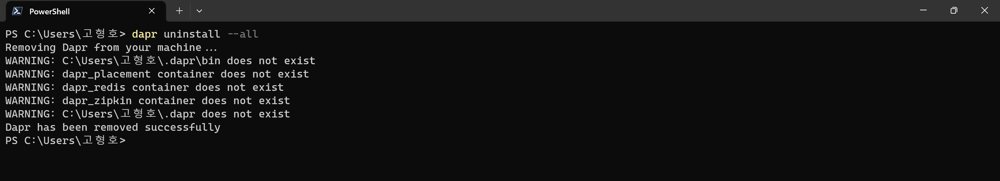

# Dapr CLI 제거
- [x] [Uninstall CLI command reference](https://docs.dapr.io/reference/cli/dapr-uninstall/)
- [x] [Uninstall Dapr in a self-hosted environment](https://docs.dapr.io/operations/hosting/self-hosted/self-hosted-uninstall/)

## 목차
- [x] Dapr CLI 제거
- [x] Dapr CLI Uninstall 옵션

<br/>

## Dapr CLI 제거

- `dapr init` 전(Dapr Runtime 설치 전) 제거할 때
  - dapr 관련 도커와 설정 파일 경로가 존재하지 않는다.
  - 경로 : %UserProfile%\.dapr
  - 컨테이너 : dapr_placement, dapr_redis, dapr_zipkin

<br/>

## Dapr CLI Uninstall 옵션
| 대상                      | uninstall | uninstall --all |
| ---                       | ---       | ---       |
| $Env:SystemDrive\dapr     | O         | O         |
| dapr.exe                  | O         | O         |
| %UserProfile%\.dapr       | X         | O         |
| dapr_placement            | O         | O         |
| dapr_redis                | X         | O         |
| dapr_zipkin               | X         | O         |

```shell
dapr uninstall
```
- `uninstall` 단순 설치 제거는 Dapr Sidecar 바이너리(dapr.exe)와 dapr_placement 컨테이너만 제거한다.
  만약 dapr_redis와 dapr_zipkin 컨테이너까지 모두 삭제하기 위해서는 `--all` 옵션을 추가해야 한다.
- `dapr_placement, dapr_redis, dapr_zipkin` 컨테이너는 `dapr init` 명령으로 Runtime을 초기화할 때 설치됩니다.
```shell
dapr uninstall --all
```
- `$UserProfile%\.dapr` 폴더와 도커 이미지를 모두 삭제한다.